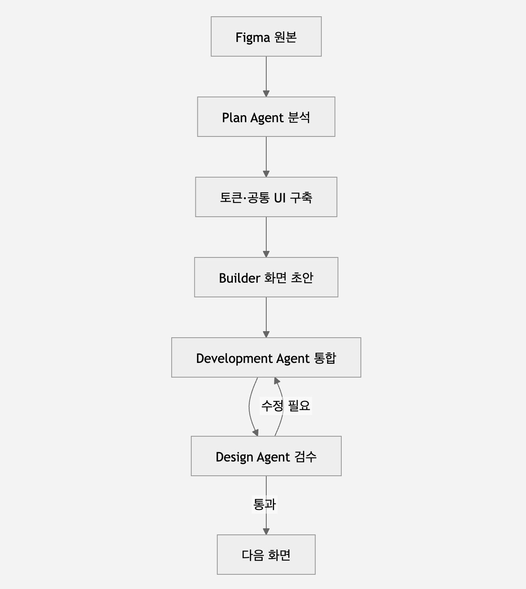

Agent와 규칙 생성 → 디자인 토큰 추출 → 공통 UI 구현 → Builder에 컴포넌트 연결 → 화면 한 개 생성 → Claude Code 통합 → Design Agent 검수 → 다음 화면 반복

flowchart TD
    A["Figma 원본"] --> B["Plan Agent 분석"]
    B --> C["토큰·공통 UI 구축"]
    C --> D["Builder 화면 초안"]
    D --> E["Development Agent 통합"]
    E --> F["Design Agent 검수"]
    F -->|수정 필요| E
    F -->|통과| G["다음 화면"]

    

references/
└─ claude-design/
   ├─ source/              # Claude Design ZIP 압축 해제본
   ├─ screenshots/         # 화면별 기준 이미지
   ├─ assets/              # 로고, 아이콘, 일러스트
   └─ README.md            # Figma 링크와 화면 설명

docs/
├─ FIGMA_SCREEN_MAP.md
├─ DESIGN_SYSTEM.md
├─ DESIGN_TOKEN_MAP.md
├─ COMPONENT_MAP.md
└─ FRONTEND_IMPLEMENTATION_PLAN.md

서버 구동 명령어 
corepack pnpm -F web dev
종료시 
lsof -ti:5173 -sTCP:LISTEN | xargs kill

너가 구현을 진행하는 동안에는 내가 다른 일을 하다가, 승인이 필요하거나, 질문에 답을 해야 하는 경우 소리로 알림을 해서 내가 알기 쉽게 할 수 있어?

프론트엔드(웹앱)	http://localhost:5173	로그인 화면부터
API 헬스체크	http://localhost:4000/health	불필요 ({"status":"ok"} 확인됨)
문제 인식	POST http://localhost:4000/api/problems/recognize	Bearer 토큰 필요
풀이 생성	POST http://localhost:4000/api/problems/:problemId/solve	Bearer 토큰 필요

 http://172.30.1.69:5173/

 # 1) 현재 IP 확인
ifconfig | grep "inet " | grep -v 127.0.0.1

# 2) (IP가 바뀌었으면) 인증서 재발급 — <새IP> 자리에 실제 IP 넣기
cd "/Users/soojin/Library/CloudStorage/OneDrive-개인/vibeStudy/WhyMath"
mkcert -cert-file apps/web/.cert/cert.pem -key-file apps/web/.cert/key.pem localhost 127.0.0.1 <새IP>
mkcert -cert-file apps/api/.cert/cert.pem -key-file apps/api/.cert/key.pem localhost 127.0.0.1 <새IP>

# 3) (IP가 바뀌었으면) .env 2곳 수정
#    apps/web/.env  → VITE_API_BASE_URL=https://<새IP>:4000
#    apps/api/.env  → CORS_ORIGIN=http://localhost:5173,https://localhost:5173,https://<새IP>:5173

# 4) 서버 기동 (각각 새 터미널 탭 또는 백그라운드)
pnpm -F api dev
pnpm -F web dev -- --host

scripts/dev-lan.sh/dev-lan-stop.sh의 API 서버 pkill 패턴 버그를 고쳤어요 (--env-file=.env src/server.ts로 매칭 — 부모/자식 tsx 프로세스 둘 다 잡힘). 누적됐던 orphan 프로세스도 정리했고, 재테스트로 stop 스크립트가 이제 fallback 없이 바로 API 서버를 잡는 걸 확인했습니다.

서버는 현재 정상 기동 중입니다: https://172.30.1.84:5173/ (iPad), https://172.30.1.84:4000/health (API).

시작: ./scripts/dev-lan.sh
중지: ./scripts/dev-lan-stop.sh